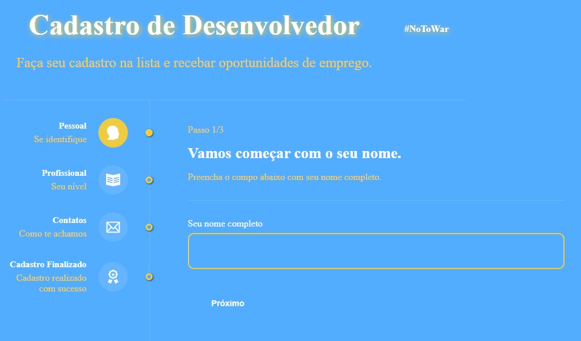
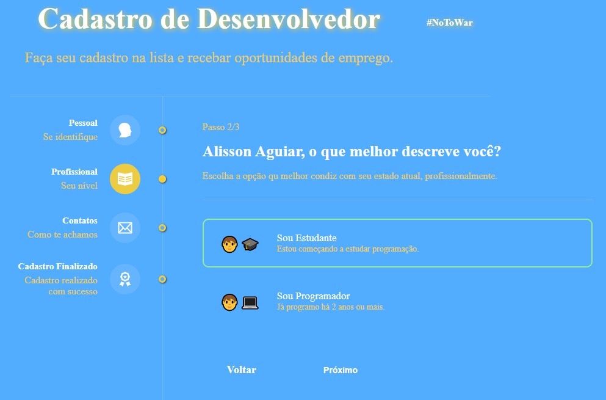
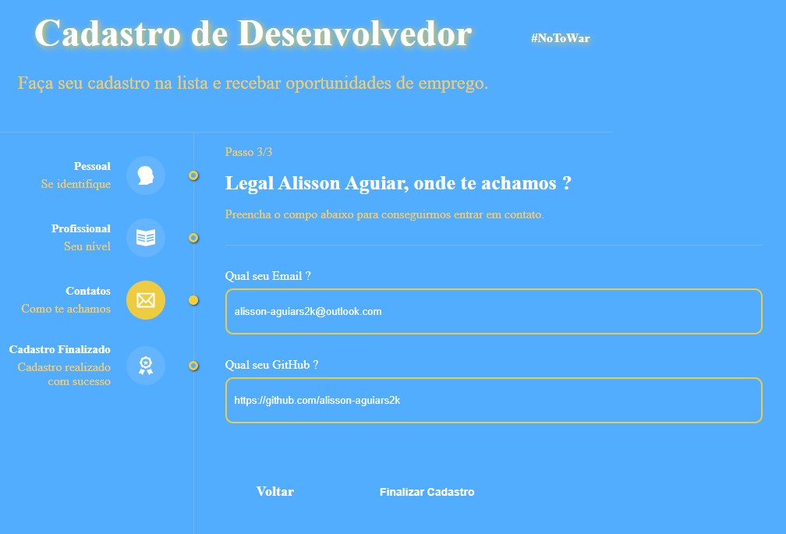
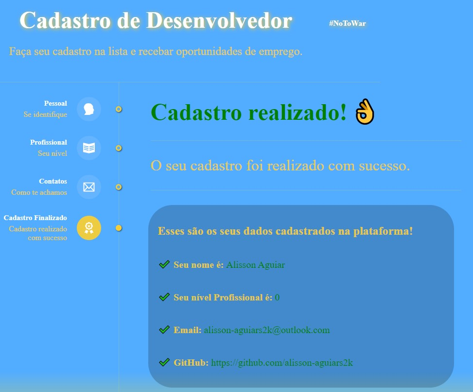

## Multi Form ! 👨‍💻 👩‍💻
### #NoToWar
 

## Nesse aplicação podemos cadastrar desenvolvedores em busca de oportunidades na área da programação. 😃 

### [Person Finances](https://react-js-person-finances.netlify.app/) 🔗

## Tecnologias que utilizei para o projeto ;  

 
    
    
    
    

 

##  As etapas :
- Pessoal  ( Nome Completo ) ;
- Profissional ( Estudante || Programador ) ;
- Contatos ( Email || GitHub  ) ;
- Cadastro Finalizado ;
## O código foi desenvolvido usando os conceitos ; 
- Hooks ; useState, useEffect, useReducer e useContext ;
- As rotas foram criadas com React Router Dom 6.
- Resposivo
- Clean Code
## A estilização ; 
- Styled Components;  
## 🎲 Rodando o Back End (servidor)
- npm install
- npm start